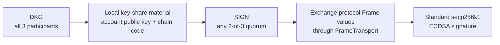
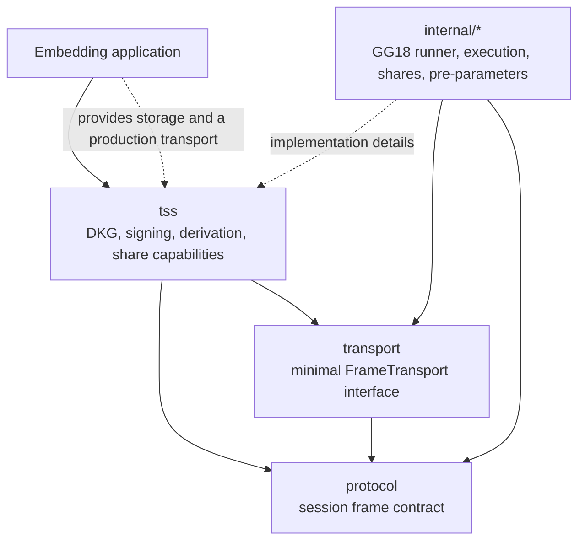

# BroSettlement MPC Core

[](https://go.dev/)
[](https://pkg.go.dev/github.com/BroLabel/brosettlement-mpc-core)
[](LICENSE)

BroSettlement MPC Core is a Go library for distributed key generation (DKG),
derived threshold signing, and transport-neutral MPC frame exchange. It is
intended for teams building custody, wallet, and co-signing systems where no
single participant should ever hold the complete private key.

The ECDSA implementation uses the GG18 protocol over secp256k1 through
[`bnb-chain/tss-lib`](https://github.com/bnb-chain/tss-lib). The public API
supports 2-of-3 DKG and signing, non-hardened BIP32 child-key derivation, and a
small frame transport contract that applications can bind to their own relay,
queue, or authenticated peer-to-peer network.

## How it works

### Session lifecycle



DKG creates a different local key share for every participant and a common
account public key; the private key is never reconstructed. A later signing
session selects any two participants, derives the same non-hardened child key
from their stored material, exchanges protocol frames, and produces a standard
ECDSA signature.

### Package layers



Only `tss`, `protocol`, and `transport` are public packages. Everything under
`internal/*` can change without notice and must not be imported by consumers.

## Install

### Protocol progress watchdog

The default runner warns after 30 seconds without protocol progress and fails
after 120 seconds (`TSS_STALL_WARN` and `TSS_STALL_FAIL`). These defaults apply
to both DKG and SIGN. Explicit environment overrides take precedence. Increasing
the idle threshold tolerates slower rounds under CPU pressure, but does not
extend the caller's session deadline or replace admission capacity limits.
Applications pinned to an older Core version must update and rebuild to receive
the new default.

BroSettlement MPC Core requires Go 1.24 or newer.

```bash
go get github.com/BroLabel/brosettlement-mpc-core@latest
```

Import only the package needed by your integration:

```go
import "github.com/BroLabel/brosettlement-mpc-core/tss"
```

## Quickstart: 2-of-3 DKG and signing

The runnable [2-of-3 example](examples/mpc2of3/main.go) creates three services,
connects them with an in-memory frame bus, runs DKG, signs a SHA-256 digest with
the A+B quorum, and verifies the result independently with secp256k1. Initial
ECDSA DKG can take several minutes because the example generates fresh Paillier
pre-parameters at runtime.

From a clone of this repository:

```bash
go run ./examples/mpc2of3
```

The central flow is shown below. The example source also includes the small
`FrameTransport` and `ShareReader`/`ShareWriter` implementations used here.

```go
parties := []string{"A", "B", "C"}
services := make(map[string]*tss.Service, len(parties))
for _, partyID := range parties {
    shares := newMemoryShareStore(partyID)
    services[partyID] = tss.NewBnbService(
        slog.Default(),
        tss.WithShareReader(shares),
        tss.WithShareWriter(shares),
    )
}

// Every DKG participant receives the exact same 32-byte chain code.
chainCode, err := randomBytes(32)
if err != nil {
    return err
}
dkgTransport := newFrameNetwork(parties)
dkgOutputs, err := runDKG(ctx, services, dkgTransport, parties, chainCode)
if err != nil {
    return err
}

derivation := tss.DerivationContext{
    ProfileID:       "quickstart-profile",
    Chain:           "ethereum",
    Algorithm:       tss.AlgorithmECDSA,
    Curve:           tss.CurveSecp256k1,
    Scheme:          tss.DerivationSchemeBIP32Secp256k1,
    PublicKeyFormat: tss.PublicKeyFormatUncompressedHex,
    AccountPath:     "m/44'/60'/0'",
    ChildPath:       "/0/0",
}
derivedPublicKey, err := tss.DeriveECDSAChildPublicKey(
    dkgOutputs["A"].PublicKey,
    chainCode,
    derivation,
)
if err != nil {
    return err
}
derivation.DerivedPublicKey = derivedPublicKey

digest := sha256.Sum256([]byte("BroSettlement quickstart"))
signers := []string{"A", "B"}
signTransport := newFrameNetwork(signers)
if err := runSign(ctx, services, signTransport, signers, digest[:], derivation); err != nil {
    return err
}

signature, err := services["A"].ExportECDSASignature("quickstart-sign")
if err != nil {
    return err
}
if err := verifyECDSA(derivedPublicKey, digest[:], signature.GetR(), signature.GetS()); err != nil {
    return err
}
```

The in-memory bus is for examples and tests only. The library intentionally does
not choose a production networking model: the embedding application implements
`transport.FrameTransport` and is responsible for delivery, peer
authentication, confidentiality, integrity, replay policy, and operational
timeouts. In session descriptors, `Threshold` is the required signer count
(`2` for 2-of-3), not the zero-based threshold used internally by
`tss-lib`.

## Packages and public API boundary

| Package | Responsibility |
| --- | --- |
| [`tss`](https://pkg.go.dev/github.com/BroLabel/brosettlement-mpc-core/tss) | High-level DKG and signing sessions, derivation contracts, pre-parameter lifecycle, and capability-based share persistence interfaces. |
| [`protocol`](https://pkg.go.dev/github.com/BroLabel/brosettlement-mpc-core/protocol) | Transport-neutral MPC frame fields used for routing, session binding, round metadata, and derivation-context commitments. |
| [`transport`](https://pkg.go.dev/github.com/BroLabel/brosettlement-mpc-core/transport) | The minimal `FrameTransport` interface. Production adapters belong to the embedding application; this repository provides an in-memory implementation only in the runnable example and integration tests. |
| `internal/*` | GG18 execution, key-share codecs, derivation internals, pre-parameter management, and other unsupported implementation details. |

The supported import boundary is limited to `tss`, `protocol`, and `transport`.
Public callers should persist only the opaque `CodecBlob` supplied to
`tss.ShareWriter`; use `tss.InspectEncodedECDSAKeyMaterial` when safe metadata
evidence is needed without exposing the underlying share.

## Key derivation

### Model

ECDSA DKG creates account-level key material: one local share per participant,
a common account public key, and a 32-byte chain code supplied by the
orchestration layer. Signing does not operate on that account key directly.
Instead, a `tss.DerivationContext` selects a non-hardened BIP32 child path, and
each signer derives compatible child-share material locally. The chain code is
stored with the share after DKG; it is not sent in SIGN requests.

### Why the commitments are strict

Every participant in one DKG intent must receive the byte-identical chain code.
A different chain code produces a different BIP32 key tree even when the DKG
public key is the same. Core therefore validates and persists the chain code,
while the upstream orchestrator must compare the complete participant output
set before activating the key.

For signing, Core normalizes the derivation context with
`tss.DerivationContextHashV1` and carries the resulting commitment in SIGN
frames. Participants fail closed if their profile or path commitments differ.
The public SIGN API deliberately rejects root and account-key signing: requiring
an explicit child path reduces the blast radius of an authorization or routing
mistake and keeps account-level material out of transaction-signing flows.

### Responsibility boundary

Core performs DKG, persists opaque local key material through caller-provided
capabilities, derives non-hardened ECDSA child keys, binds signing peers to the
same derivation context, and returns the local protocol result.

`RunDKGSession`, `RunDKGSessionWithPreParams`, and `RunSignSession` are
completion barriers. On success, failure, or context cancellation, they return
only after session-owned protocol workers, transport pumps, result bridges, and
result callbacks have stopped. Callers can release session capacity after the
method returns without allowing a late frame or signature callback from that
session.

The embedding orchestration layer remains responsible for:

- generating and distributing one chain code per ECDSA DKG intent;
- comparing matching DKG outputs from the complete required participant set
  before key activation;
- storing derivation profiles and authorizing profile/account-path ownership;
- computing chain-specific child addresses; and
- validating `ExpectedAddress` against chain-specific rules.

### Reserved contracts

EdDSA derivation constants are reserved in the public contract for future
compatibility. Derived EdDSA signing is not implemented and returns
`tss.ErrDerivedSigningUnsupported`.

## Security

Read [SECURITY.md](SECURITY.md) before integrating the library and report
vulnerabilities through the private channel documented there. Contributions
should follow [CONTRIBUTING.md](CONTRIBUTING.md).

The network is assumed to be untrusted. Core validates session and derivation
commitments, but the caller must provide authenticated transport, signing
authorization, durable and confidential share storage, secret lifecycle
controls, and deployment-specific key activation policy. A host or storage
domain containing enough shares to meet the threshold is quorum-bearing and
must be protected accordingly.

## Testing

Run the complete unit and integration suite:

```bash
go test ./...
```

The repository includes an explicit
[end-to-end 2-of-3 test](tss/mpc2of3_integration_test.go). It generates fresh
DKG pre-parameters and key shares, signs with every A+B, A+C, and B+C quorum
across multiple derived paths, and verifies each signature independently with
secp256k1:

```bash
go test ./tss -run TestMPC2Of3DKGAndEverySigningSubset -count=1
```

Because it generates cryptographic pre-parameters at runtime, this test can take
several minutes.

## Used by

- [BroSettlement MPC Co-Signer](https://github.com/BroLabel/brosettlement-mpc-co-signer) — a customer-hosted service that uses this library for BroSettlement 2-of-3 DKG, derived signing, and MPC frame exchange.

## Versioning

Releases use [Semantic Versioning](https://semver.org/) tags such as `v0.4.4`.
Consumers should pin an explicit tag. Before `v1.0.0`, minor releases may
include breaking changes to the public packages; `internal/*` is never covered
by compatibility guarantees.

## License

Licensed under the [Apache License 2.0](LICENSE).
